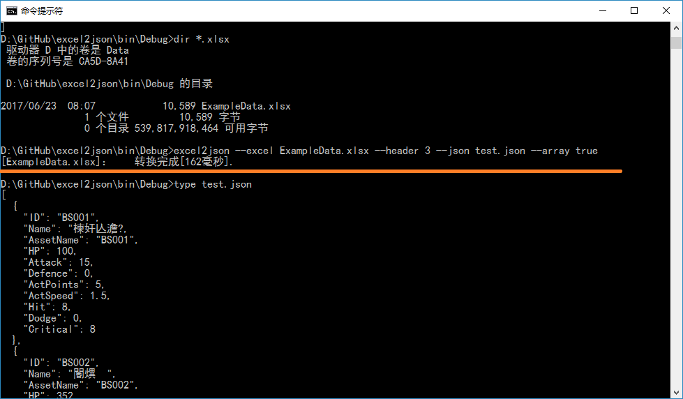

excel2json
==========

- 把Excel表单转换成json对象，并保存到一个文本文件中。
- 表格格式见:ExampleData.xlsx
- 支持导出为数组 Json格式，每一行转换为数组的一行，[结构如下](./ExampleDataExportArray.json)：
[
	{行内容},
	{行内容},
	{...},
]
- 支持导出为Dictionary Json对象, 每一行转换成一个json对象。[结构如下](./ExampleDataExportDict.json)：
{
	ID:{行内容},
	ID:{行内容},
	ID:{...}
}

Excel表单格式约定
-----------------
  - 第一行固定作为列名（用来构造json字段名称）；
  - 第一列固定作为对象的ID；
  - 读取Excel Workbook中的第一个sheet；
  - 对于SQL导出模式：第二行固定为字段类型
  - 使用表头生成C#数据定义代码

命令行参数
---------
-  -e, --excel       Required. 输入的Excel文件路径.
-  -j, --json        指定输出的json文件路径.
-  -s, --sql         指定输出的SQL文件路径.
-  -p, --csharp      指定输出的C#数据定义代码文件路径.
-  -h, --header      Required. 表格中有几行是表头.
-  -c, --encoding    (Default: utf8-nobom) 指定编码的名称.
-  -l, --lowcase     (Default: false) 自动把字段名称转换成小写格式.

例如：**excel2json --excel test.xlsx --json test.json --header 3 --array true**，其中的输入和输出文件，都在当前目录下；
